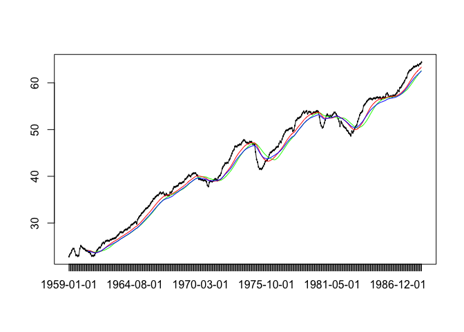
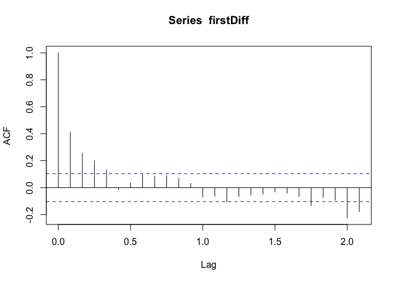
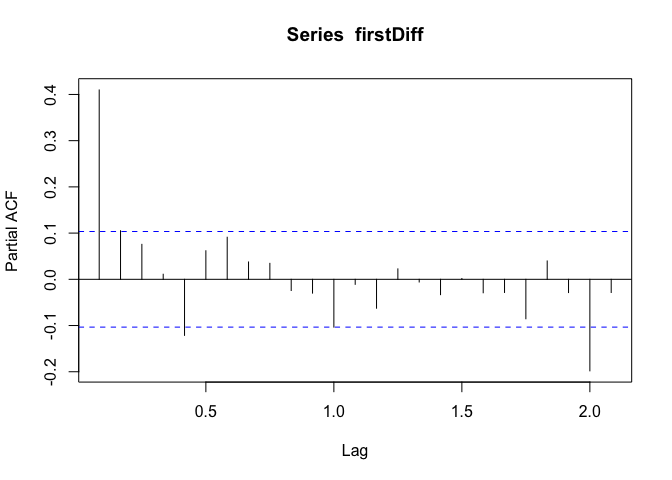
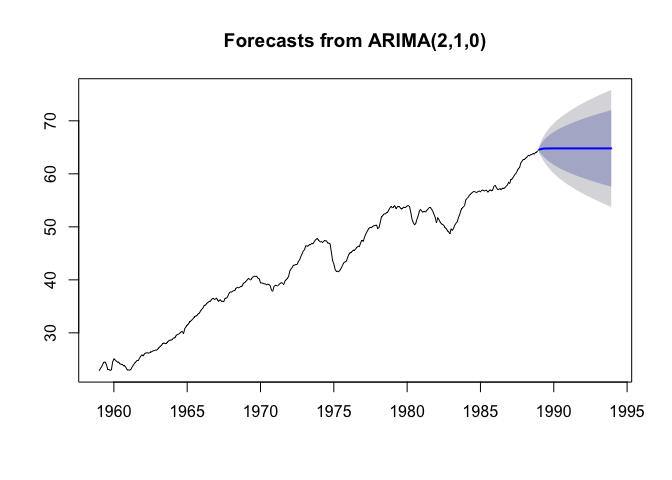
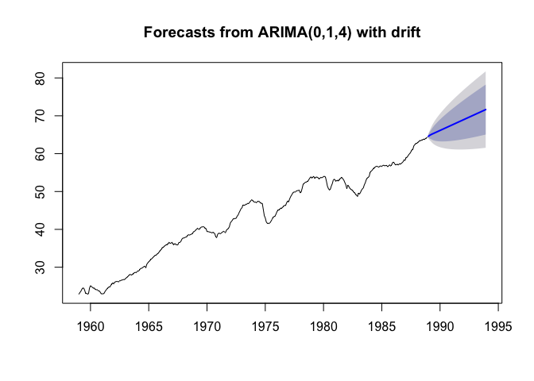

Task1
================

Какие библиотеки использовались?
--------------------------------

При исследовании временных рядов было использовано три библиотеки `TTR`, `tseries`, `forecast` При отсутсвии данных пакетов требуется ввести в консоль ввода / вывода `install.packages("packageName")`

``` r
library(TTR)
library(tseries)
library(forecast)
library(MLmetrics)
```

    ## 
    ## Attaching package: 'MLmetrics'

    ## The following object is masked from 'package:base':
    ## 
    ##     Recall

Считывание данных
-----------------

Данные считываются при помощи функции `read.csv(file="имя_файла")`. Полный путь к файлу указывать необязательно. При запуске команды из командной строки файл будет искать в дириктории файла. При работе в `R Studio` необходимо перейти во вкладку `Session` &gt; `Set Working Directory` &gt; `To Source File Location`. После чего файл будет искаться в дириктории файла

``` r
data = read.csv(file = "training.csv")
dataTS = ts(data$Value, frequency = 12, start = c(1959))
```

`dataTS` нам понадобится позже и будет неоднократно использоваться

Первая часть задания
--------------------

Исследование временного ряда на его стационарность проводилось визуальным образом. Было построено три различных скользящих средних: WMA, SMA, EMA. Все скользящие статистики были взяты с параметром n = 20 (порядок)

-   SMA - зеленный маркер
-   WMA - красный маркер
-   EMA - синий маркер
-   Черным цветом изображен оригинальный временной ряд

``` r
drawBaseStatistics <- function(date, value, n = 20) {
  # calculating
  # sma 
  SMAValue <- SMA(value, n = n)
  # wma
  WMAValue <- WMA(value, n = n)
  # ema
  EMAValue <- EMA(value, n = n)
  
  # create plot obj
  plot(date, value)
  # visualisation
  # original points
  lines(date, value)
  # SMA
  lines(x = date, y = SMAValue, col = "green")
  # WMA
  lines(x = date, y = WMAValue, col = "red")
  # EMA
  lines(x = date, y = EMAValue, col = "blue")
}

drawBaseStatistics(data$Date, data$Value)
```



По полученным графикам определенно можно сказать, что ряд не стационарный

Вторая часть задания
--------------------

Напрямую разложить исходный ряд на тренд, сезональность и остаток не удается, так как он не периодичен, поэтому применим к нему взятие натурального логарифма - `log()`. Определять стационарность полученных компонент после разложения будет при помощи теста Дики - Фуллера

Напишем функцию, которая будет раскладывать исходный ряд в соответсвии с type, который может быть `c("additive")` или `c("multiplicative")` и возвращать полученные компоненты

``` r
decomposeSeriesBy <- function(series, type = c("additive")) {
  logSeries = log(series)
  
  addModel <- decompose(logSeries, type = type)
  
  return (addModel)
}
```

Так же напишем функцию, которая будет удалять NA значения из набора данных, чтобы к ним можно было применить тест Дики - Фуллера (именно по нему будет определяться) для определения стационарности

``` r
removeNa <- function(value) {
  return (value[!is.na(value)])
}
```

Разложим ряд на компоненты

``` r
addModelData = decomposeSeriesBy(dataTS, c("additive"))
```

Сезонная составляющая

``` r
seasonalData = addModelData$seasonal
seasonalData = removeNa(seasonalData)

adf.test(seasonalData, alternative="stationary", k = 12)
```

    ## Warning in adf.test(seasonalData, alternative = "stationary", k = 12): p-
    ## value smaller than printed p-value

    ## 
    ##  Augmented Dickey-Fuller Test
    ## 
    ## data:  seasonalData
    ## Dickey-Fuller = -2.0543e+14, Lag order = 12, p-value = 0.01
    ## alternative hypothesis: stationary

Можно сказать, что ряд стационарный, так как значение `p` очень мало Проверим остаток таким же образом

``` r
randomData = addModelData$random
randomData = removeNa(randomData)

adf.test(randomData, alternative="stationary", k = 12)
```

    ## Warning in adf.test(randomData, alternative = "stationary", k = 12): p-
    ## value smaller than printed p-value

    ## 
    ##  Augmented Dickey-Fuller Test
    ## 
    ## data:  randomData
    ## Dickey-Fuller = -6.4725, Lag order = 12, p-value = 0.01
    ## alternative hypothesis: stationary

Как и в составляющей сезонности можно говорить о стационарности из-за малого значения `p`

Аналогично исследуем разложим ряд в соотвествии с мультипликативной моделью и исследуем получившиеся компоненты

``` r
multModelComponents = decomposeSeriesBy(dataTS, c("multiplicative"))
```

Сезонная составляющая:

``` r
seasonalData = multModelComponents$seasonal
seasonalData = removeNa(seasonalData)

adf.test(seasonalData, alternative="stationary", k = 12)
```

    ## Warning in adf.test(seasonalData, alternative = "stationary", k = 12): p-
    ## value smaller than printed p-value

    ## 
    ##  Augmented Dickey-Fuller Test
    ## 
    ## data:  seasonalData
    ## Dickey-Fuller = -8.0093e+10, Lag order = 12, p-value = 0.01
    ## alternative hypothesis: stationary

Ряд стационарный, так как значение `p` очень мало Применим тест к остатку

``` r
randomData = multModelComponents$random
randomData = removeNa(randomData)

adf.test(randomData, alternative="stationary", k = 12)
```

    ## Warning in adf.test(randomData, alternative = "stationary", k = 12): p-
    ## value smaller than printed p-value

    ## 
    ##  Augmented Dickey-Fuller Test
    ## 
    ## data:  randomData
    ## Dickey-Fuller = -6.5625, Lag order = 12, p-value = 0.01
    ## alternative hypothesis: stationary

Видим, что `p` мало - составляющая остатка стационарна

Составляющая тренда в обоих моделях не исследовалась из-за очевидной нестационарности

Третья часть задания
--------------------

Найдем минимальное `k` при котором ряд будет интегрируемым, фактически это значит применить последовательную разность элементов `k` раз и проверить получившийся ряд на стационарность. В языке `R` для этого есть функция `diff`. При исследовании получилось, что достаточно один раз применить функции diff к исходному ряду для получения стационарного (то есть `k = 1`)

``` r
firstDiff = diff(dataTS)

adf.test(firstDiff, alternative="stationary", k = 12)
```

    ## Warning in adf.test(firstDiff, alternative = "stationary", k = 12): p-value
    ## smaller than printed p-value

    ## 
    ##  Augmented Dickey-Fuller Test
    ## 
    ## data:  firstDiff
    ## Dickey-Fuller = -4.8877, Lag order = 12, p-value = 0.01
    ## alternative hypothesis: stationary

Далее вычислим функцию автокорреляции и функции частичной автокорреляции

``` r
acf <- acf(firstDiff)
```



``` r
pacf <- pacf(firstDiff)
```



На основе acf и pacf исследуем случаи \* Arima(1, 1, 1) \* Arima(2, 1, 0) \* Arima(0, 1, 4)

Arima(1, 1, 1):

``` r
arima111 = Arima(dataTS, order = c(1, 1, 1))

fArima111 = forecast.Arima(arima111, h = 60)
plot.forecast(fArima111)
```


Arima(2, 1, 0)

``` r
arima210 = Arima(dataTS, order = c(2, 1, 0))

fArima210 = forecast.Arima(arima210, h = 60)
plot.forecast(fArima210)
```



Arima(0, 1, 4)

``` r
arima014 = Arima(dataTS, order = c(0, 1, 4), include.drift = TRUE)

fArima014 = forecast.Arima(arima014, h = 60)
plot.forecast(fArima014)
```



Вычислим r2\_Score для каждого из прогнозов

``` r
testData = read.csv(file = "testing.csv")
testTS = ts(testData$Value, frequency = 12, start = c(1989))

R2_Score(fArima111$mean, testTS)
```

    ## [1] -0.02447902

``` r
R2_Score(fArima210$mean, testTS)
```

    ## [1] -0.08292902

``` r
R2_Score(fArima014$mean, testTS)
```

    ## [1] -3.227064

Посчитаем значение коэффициента Акаике

``` r
AIC(arima111)
```

    ## [1] 255.6413

``` r
AIC(arima210)
```

    ## [1] 258.5099

``` r
AIC(arima014)
```

    ## [1] 245.0053
